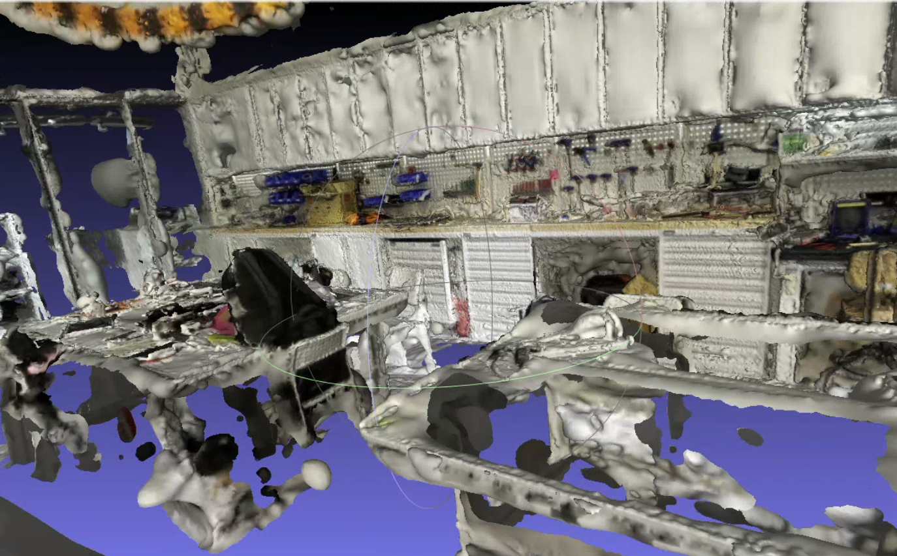
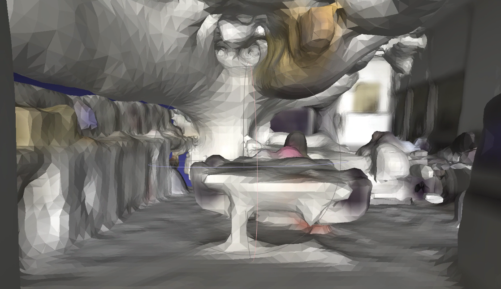

# 3DGS-Experiment

[Experiment Slide](https://docs.google.com/presentation/d/1k3vyd9FIJsa2UyoERYGh8KzX8PYp0r6A9unCBD-zv8Q/edit?slide=id.g3a92883aae3_1_11#slide=id.g3a92883aae3_1_11)

This is for tracking the 3D reconstruction experiments from the past month.

Our goal is to reconstruct a mesh from photos and create a 3D scene with physical properties.

<video src="assets/SuGaR_1127_3DGS_Mesh_Physics.mp4" controls width="600">
Your browser does not support the video tag.
</video>

*Generated using SuGaR and applied in IsaacSim.*

## Different Technical Approaches

### 1. Traditional Multi-View Geometry-Based Methods
This method uses Structure-from-Motion (SfM) to estimate camera poses and generate sparse point clouds, followed by Multi-View Stereo (MVS) to densify the point clouds and create detailed 3D models.

**Advantages**:  
* High precision  
* Mature tools (e.g., COLMAP)  
* Scalable  

**Disadvantages**:  
* High computational cost  
* Sensitive to input quality  
* Unsuitable for dynamic scenes  
* Sensitive to occlusions/textureless surfaces  
  
#### COLMAP [[Link](https://github.com/colmap/colmap)]

COLMAP is a general-purpose Structure-from-Motion (SfM) and Multi-View Stereo (MVS) pipeline with a graphical and command-line interface.

*This 3D mesh was generated using COLMAP's Dense Reconstruction pipeline.*

### 2. Deep Learning-Based Single-View Reconstruction
#### Depth Anthing 3 [[Link](https://github.com/ByteDance-Seed/Depth-Anything-3)]

*This 3D mesh was generated by converting the point cloud predicted by Depth Anything 3.*

### 3. 3D Gaussian Splatting (3DGS)-Based Methods

#### 3DGRUT [[Link](https://github.com/nv-tlabs/3dgrut)]

#### 2DGS [[Link](https://github.com/hbb1/2d-gaussian-splatting)]
#### SuGaR [[Link](https://github.com/Anttwo/SuGaR)]

**⚠ Note: The experimental results were obtained using different datasets.**
## Attachment
## Reference

